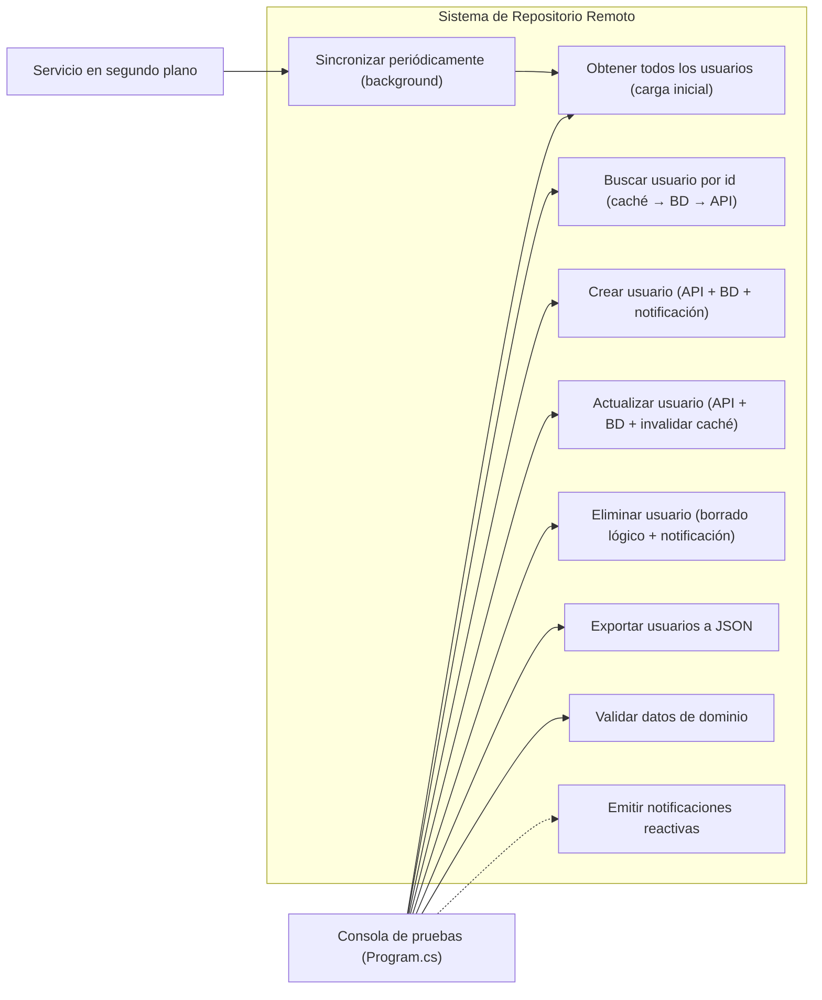
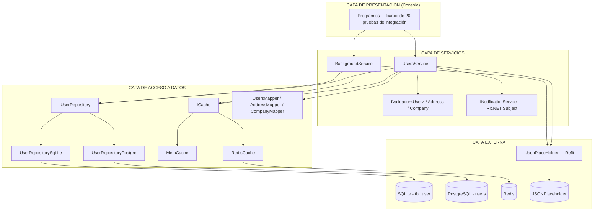
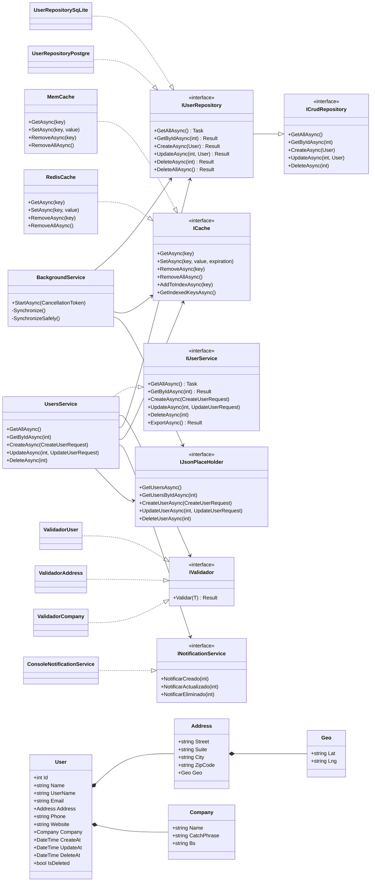
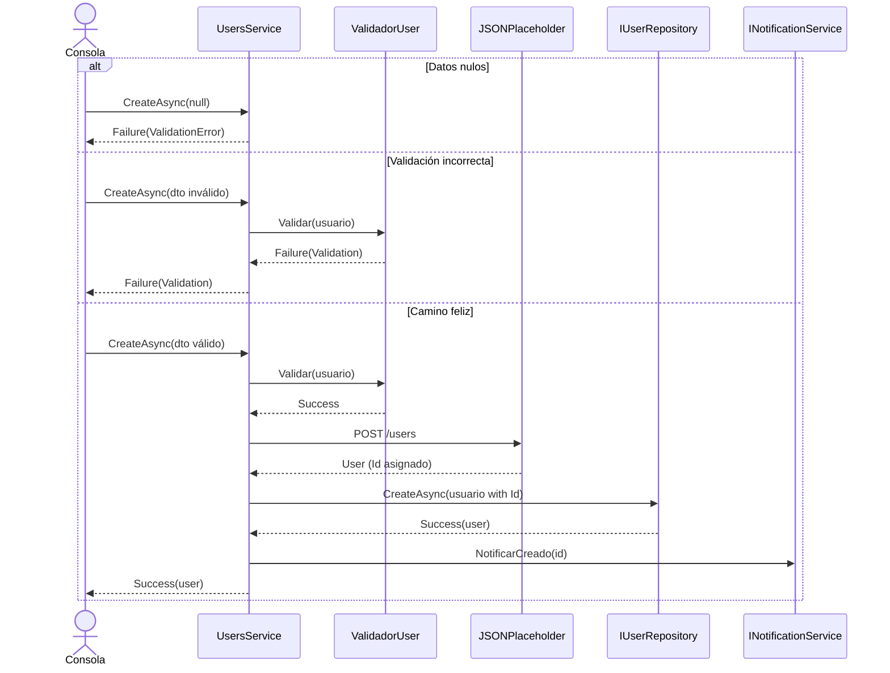
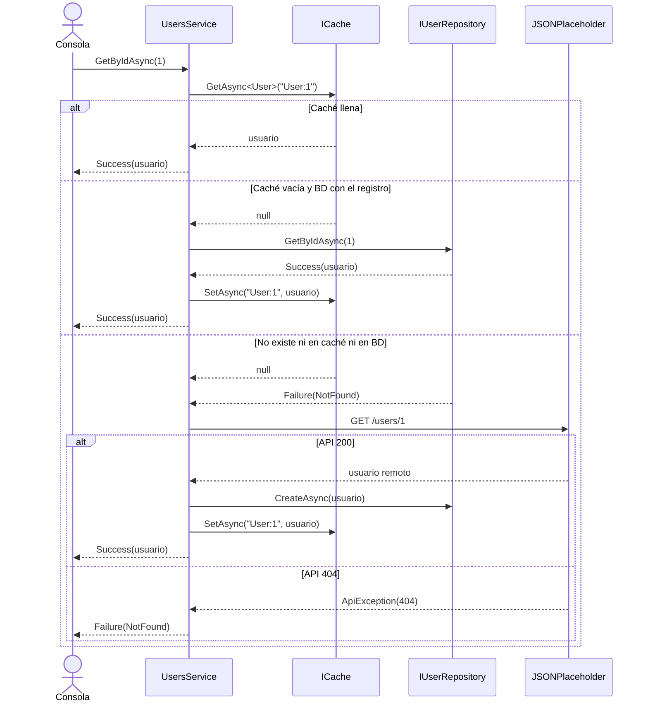
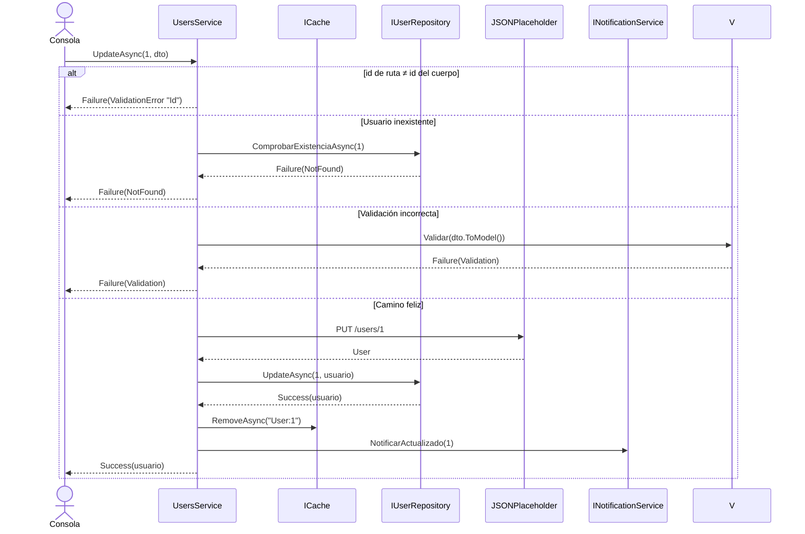
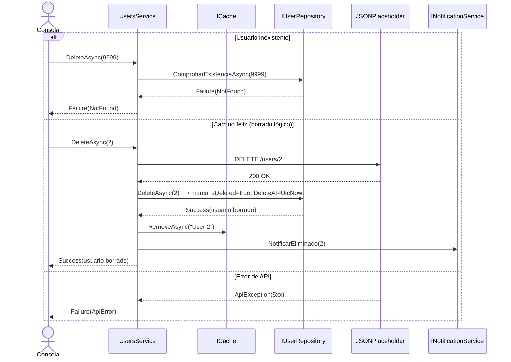

# DOCUMENTACIÓN DEL PROYECTO
# Practicas Repositorio Remoto
## Sistema de Repositorio Remoto — Gestión de Usuarios (caché + BD local + API REST)

**Fecha:** 08/10/2026

---

## Índice

1. [Introducción](#1-introducción)
2. [Descripción del Problema](#2-descripción-del-problema)
3. [Requisitos Funcionales](#3-requisitos-funcionales)
4. [Requisitos No Funcionales](#4-requisitos-no-funcionales)
5. [Requisitos de Información](#5-requisitos-de-información)
6. [Diagrama de Casos de Uso](#6-diagrama-de-casos-de-uso)
7. [Diagrama de Arquitectura](#7-diagrama-de-arquitectura)
8. [Diseño de Base de Datos](#8-diseño-de-base-de-datos)
9. [Diagrama de Clases](#9-diagrama-de-clases)
10. [Diagramas de Secuencia — Operaciones CRUD](#10-diagramas-de-secuencia--operaciones-crud)
11. [Análisis Económico](#11-análisis-económico)
12. [Anexos](#12-anexos)

---

## 1. Introducción

El presente documento describe el desarrollo del proyecto **Practicas Repositorio Remoto**, una aplicación de consola desarrollada en **.NET 10** cuyo objetivo es demostrar el patrón de **repositorio con tres niveles de almacenamiento coherentes**: una **caché** (en memoria o Redis), una **base de datos local** (SQLite o PostgreSQL) y una **API REST remota** (JSONPlaceholder).

El sistema actúa como un **banco de pruebas de integración**: gestiona usuarios mediante operaciones CRUD que se propagan por los tres niveles, valida rigurosamente los datos de dominio, emite notificaciones reactivas ante cada operación y ejecuta una sincronización periódica en segundo plano para mantener la base de datos local copiada de la API remota.

En esta documentación se presentan los requisitos funcionales y no funcionales, la arquitectura del sistema, el diseño de base de datos, diagramas UML y un análisis económico del proyecto, adaptando la estructura al caso real de esta aplicación.

**Tecnologías principales:** .NET 10, C# `latest`, Entity Framework Core 10 (SQLite y Npgsql), Refit 16 (cliente REST generado), StackExchange.Redis, Microsoft.Extensions.Caching.Memory, System.Reactive (Rx.NET), CSharpFunctionalExtensions, Serilog, Scrutor y NUnit + Testcontainers.

---

## 2. Descripción del Problema

- **Problema:** necesidad de construir un sistema que mantenga **coherentes tres niveles de almacenamiento** (caché, base de datos local y API REST remota), de modo que la aplicación siga funcionando aunque la API externa falle, y que permita **cambiar el motor de persistencia y de caché mediante configuración**, sin recompilar el código.

- **Reto añadido:** las operaciones de escritura deben validarse antes de salir hacia la API, la lectura debe soportar el patrón *cache-aside* (caché → BD → API), el borrado debe ser lógico para no perder datos, y un servicio en segundo plano debe **resincronizar periódicamente** la BD local con el origen remoto (vaciando la tabla y reinsertando desde la API).

---

## 3. Requisitos Funcionales

### RF-01: Gestión de Usuarios (CRUD)

| ID       | Descripción                                                                                                            | Prioridad |
|----------|------------------------------------------------------------------------------------------------------------------------|-----------|
| RF-01.1  | Obtener todos los usuarios: si la BD local está vacía, los descarga de la API y los persiste.                          | Alta      |
| RF-01.2  | Buscar un usuario por id mediante el flujo caché → BD local → API REST (*cache-aside*).                                | Alta      |
| RF-01.3  | Crear un usuario: validar, enviar a la API, persistir en la BD local y emitir notificación.                            | Alta      |
| RF-01.4  | Actualizar un usuario: validar, enviar a la API, actualizar la BD local, invalidar la caché y notificar.               | Alta      |
| RF-01.5  | Eliminar un usuario (borrado lógico con `IsDeleted`/`DeleteAt`), retirarlo de la caché y notificar.                    | Alta      |
| RF-01.6  | Exportar el conjunto de usuarios a un fichero JSON (`data/users.json`).                                                | Media     |

### RF-02: Validaciones de Negocio

| ID       | Descripción                                                                                                            | Prioridad |
|----------|------------------------------------------------------------------------------------------------------------------------|-----------|
| RF-02.1  | El nombre es obligatorio y no puede estar en blanco.                                                                   | Alta      |
| RF-02.2  | El alias de usuario solo admite caracteres alfanuméricos, `_` o `.`.                                                   | Alta      |
| RF-02.3  | El email debe cumplir el formato `local@dominio.tld` (con TLD alfabético de 2+ caracteres).                            | Alta      |
| RF-02.4  | El teléfono debe ser español: prefijo `+34` opcional y 9 cifras que empiezan por 6–9.                                  | Alta      |
| RF-02.5  | El sitio web debe ser una URL `http/https` válida (se normaliza el esquema cuando falta).                              | Alta      |
| RF-02.6  | La fecha de creación no puede ser futura y la de actualización no puede ser anterior a la de creación.                 | Alta      |
| RF-02.7  | La dirección exige calle, bloque/piso y ciudad obligatorios, código postal de 5 dígitos (extensión −4 opcional) y coordenadas con formato numérico. | Alta |
| RF-02.8  | La compañía exige nombre, eslogan y lema de negocio obligatorios.                                                      | Alta      |
| RF-02.9  | No se imponen longitudes mínimas ni máximas: el requisito de dominio es que el texto exista y no esté en blanco.        | Media     |

### RF-03: Sincronización y Notificaciones

| ID       | Descripción                                                                                                            | Prioridad |
|----------|------------------------------------------------------------------------------------------------------------------------|-----------|
| RF-03.1  | Lectura jerárquica caché → BD local → API REST; la caché solo se puebla al leer (*cache-aside*).                       | Alta      |
| RF-03.2  | Sincronización periódica en segundo plano (por defecto cada 60 s, configurable) que vacía la tabla y relee de la API.  | Alta      |
| RF-03.3  | Borrado físico total antes de la re-sincronización (`DeleteAllAsync`), imprescindible para no chocar con claves previas. | Alta      |
| RF-03.4  | Notificaciones reactivas (Rx.NET) en consola para creación, actualización y eliminación (`Creado`, `Actualizado`, `Eliminado`). | Media |

### RF-04: Configuración y Despliegue

| ID       | Descripción                                                                                                            | Prioridad |
|----------|------------------------------------------------------------------------------------------------------------------------|-----------|
| RF-04.1  | La persistencia se elige por configuración (`SQLite` o `Postgre`) en `appsettings.json`, sin recompilar.               | Alta      |
| RF-04.2  | La caché se elige por configuración (`Memory` o `Redis`) en `appsettings.json`.                                       | Alta      |
| RF-04.3  | Soporte de dos entornos de configuración: `Development` (SQLite + Memory) y `Production` (PostgreSQL + Redis).         | Alta      |
| RF-04.4  | Banco de **20 pruebas de integración** ejecutadas contra JSONPlaceholder que verifican que los tres niveles se mantienen coherentes. | Alta |
| RF-04.5  | Suite de **224 pruebas** (unitarias con Moq y de integración con Testcontainers) en el proyecto de tests.               | Media     |

---

## 4. Requisitos No Funcionales

| ID       | Tipo            | Descripción                                                                                                                              |
|----------|-----------------|------------------------------------------------------------------------------------------------------------------------------------------|
| RNF-01   | Rendimiento     | TTL de caché configurable (por defecto 30 min); la caché evita accesos repetidos a BD y API en lecturas.                                  |
| RNF-02   | Rendimiento     | La sincronización en segundo plano es configurable (por defecto cada 60 s) y se ejecuta en un `PeriodicTimer` con un único trabajador.      |
| RNF-03   | Mantenibilidad  | El cambio de motor de persistencia y de caché **no requiere recompilación**: solo se modifica `appsettings.json`.                          |
| RNF-04   | Mantenibilidad  | Arquitectura en capas: **Consola → Servicios → (Repositorio + Caché) → BD/API**.                                                           |
| RNF-05   | Mantenibilidad  | Testing automatizado: 224 pruebas (validadores, mappers, servicios con Moq, repositorios y caché con Testcontainers para PostgreSQL/Redis); informe de cobertura generado con coverlet. |
| RNF-06   | Fiabilidad      | Logging mediante **Serilog** a consola, con mensajes estructurados por operación.                                                          |
| RNF-07   | Seguridad       | Expresiones regulares con `RegexOptions.NonBacktracking` y *timeout* de 100 ms para evitar ataques ReDoS.                                 |
| RNF-08   | Seguridad       | Borrado lógico (`IsDeleted`/`DeleteAt`) para evitar pérdida accidental de datos; el borrado físico solo se usa en la sincronización.        |
| RNF-09   | Fiabilidad      | Manejo de errores con `Result<T, DomainError>` (NotFound, Validation, ApiError, DatabaseError) y traducción de excepciones de Refit.       |
| RNF-10   | Integración     | Consumo de API REST externa (JSONPlaceholder) mediante Refit con generación del cliente en tiempo de compilación.                          |
| RNF-11   | Portabilidad    | Aplicación de consola sobre .NET 10, ejecutable en Windows con `dotnet run` / `.exe` publicado.                                            |

---

## 5. Requisitos de Información

### Entidad: User

| Atributo   | Tipo            | Restricciones                                                                  |
|------------|-----------------|--------------------------------------------------------------------------------|
| Id         | int             | PK, autogenerado.                                                              |
| Name       | string          | Obligatorio, no en blanco (sin límites de longitud por dominio).               |
| UserName   | string          | Obligatorio; solo alfanuméricos, `_` o `.`.                                    |
| Email      | string          | Formato `local@dominio.tld` válido.                                            |
| Address    | Address         | Objeto de valor embebido (ver entidades de valor abajo).                       |
| Phone      | string          | Teléfono español: `+34` opcional, 9 cifras empezando por 6–9.                  |
| Website    | string          | URL `http/https` válida.                                                       |
| Company    | Company         | Objeto de valor embebido.                                                      |
| CreateAt   | DateTime        | Autogenerado en servidor (URC); no puede ser futura.                           |
| UpdateAt   | DateTime        | Autogenerado; no puede ser anterior a `CreateAt`.                              |
| DeleteAt   | DateTime        | `default` por defecto; se asigna al hacer borrado lógico.                      |
| IsDeleted  | bool            | Borrado lógico (`false` por defecto).                                          |

### Entidades de valor

| Entidad  | Atributo         | Tipo     | Restricciones                                                          |
|----------|------------------|----------|------------------------------------------------------------------------|
| Address  | Street / Suite   | string   | Obligatorias, no en blanco.                                             |
|          | City             | string   | Obligatoria, no en blanco.                                              |
|          | ZipCode          | string   | 5 dígitos, con extensión opcional de 4 (formato USA de JSONPlaceholder).|
|          | Geo              | Geo      | Coordenadas con formato numérico (`-37.3159`, `81.1496`).               |
| Geo      | Lat / Lng        | string   | Decimal con signo y escala variable.                                    |
| Company  | Name / CatchPhrase / Bs | string | Obligatorios, no en blanco.                                            |

---

## 6. Diagrama de Casos de Uso



---

## 7. Diagrama de Arquitectura



---

## 8. Diseño de Base de Datos

### 8.1 Esquema SQLite (`tbl_user`)

La configuración de `Development` usa SQLite con `EnsureCreated()` y `Address`/`Company` guardados como columnas JSON (`OwnsOne(...).ToJson()`).

```sql
CREATE TABLE "tbl_user" (
    "Id"       INTEGER NOT NULL CONSTRAINT "PK_tbl_user" PRIMARY KEY AUTOINCREMENT,
    "Name"     TEXT    NOT NULL,
    "UserName" TEXT    NOT NULL,
    "Email"    TEXT    NOT NULL,
    "Address"  TEXT    NOT NULL,      -- JSON propio de la dirección (incluye Geo)
    "Phone"    TEXT    NOT NULL,
    "Website"  TEXT    NOT NULL,
    "Company"  TEXT    NOT NULL,      -- JSON propio de la compañía
    "CreateAt" TEXT    NOT NULL,
    "UpdateAt" TEXT    NOT NULL,
    "DeleteAt" TEXT    NOT NULL,
    "IsDeleted INTEGER NOT NULL
);
```

### 8.2 Esquema PostgreSQL (`users`)

La configuración de `Production` usa PostgreSQL, donde `Address` y `Company` se guardan como columnas **jsonb** mediante `ValueConverter` y `ValueComparer` (los records posicionales no son enlazables como *owned entities*).

```sql
CREATE TABLE "users" (
    "Id"       INTEGER GENERATED BY DEFAULT AS IDENTITY PRIMARY KEY,
    "Name"     varchar(150) NOT NULL,
    "UserName" varchar(200) NOT NULL,
    "Email"    varchar(150) NOT NULL,
    "Address"  jsonb        NOT NULL,   -- { street, suite, city, zipCode, geo { lat, lng } }
    "Phone"    varchar(50)  NOT NULL,
    "Website"  varchar(300) NOT NULL,
    "Company"  jsonb        NOT NULL,   -- { name, catchPhrase, bs }
    "CreateAt" timestamp    NOT NULL,
    "UpdateAt" timestamp    NOT NULL,
    "DeleteAt" timestamp    NOT NULL,
    "IsDeleted boolean     NOT NULL
);
```

> **Índices recomendados** (a añadir según volumen de datos):
> - `CREATE INDEX IX_users_IsDeleted ON "users" ("IsDeleted");` — acelera los filtros de lectura (`WHERE NOT IsDeleted`).
> - `CREATE INDEX IX_users_Email ON "users" ("Email");` — búsquedas por correo.
> - `CREATE INDEX IX_users_CreateAt ON "users" ("CreateAt");` — ordenaciones por fecha.

### 8.3 Notas de persistencia

- `GetAllAsync` filtra `!IsDeleted` y ordena por `Id`; el repositorio PostgreSQL usa `AsNoTracking` para optimizar lecturas.
- El borrado lógico (`DeleteAsync`) marca `IsDeleted = true` y `DeleteAt = UtcNow`; `GetAllAsync`/`GetByIdAsync` nunca devuelven usuarios borrados.
- `DeleteAllAsync` usa `ExecuteDeleteAsync` (borrado físico sin pasar por el *change tracker*), necesario para la re-sincronización con la API.

---

## 9. Diagrama de Clases



---

## 10. Diagramas de Secuencia — Operaciones CRUD

### 10.1 Crear Usuario (camino correcto e incorrecto)



### 10.2 Leer / Buscar Usuario (cache-aside: caché → BD → API)



### 10.3 Actualizar Usuario (camino correcto e incorrecto)



### 10.4 Eliminar Usuario — Lógico + Errores



---

## 11. Análisis Económico

> Las cifras de esta sección son **estimaciones orientativas**, pues el desarrollo se realizó en un entorno académico con licencias de estudiante y Docker local.

### 11.1 Costes de Infraestructura

| Concepto                          | Coste            | Período   | Meses | Coste Total |
|-----------------------------------|------------------|-----------|-------|-------------|
| Licencia IDE (JetBrains Rider, anual) | 129 €        | Anual     | 12    | 129 €       |
| GitHub (plan gratuito/Pro)          | 4 €/mes         | Mensual   | 12    | 48 €        |
| Docker Desktop (contenedores de desarrollo) | 0 €       | —         | —     | 0 €         |
| Bases de datos y Redis (desarrollo local) | 0 €       | —         | —     | 0 €         |
| **Total Infraestructura**           |                 |           |       | **177 €**   |

### 11.2 Estimación de Esfuerzo por Fase

| Fase                                   | Horas | % del Total |
|----------------------------------------|-------|-------------|
| Análisis y Diseño                      | 10 h  | 10 %        |
| Implementación (núcleo: modelos, repositorios, caché, validadores, mappers, servicios) | 40 h | 40 % |
| Implementación (consola de pruebas y configuración) | 20 h | 20 % |
| Testing y QA (224 pruebas, Testcontainers) | 20 h | 20 %    |
| Documentación                          | 10 h  | 10 %        |
| **Total**                              | **100 h** | **100 %** |

### 11.3 Posible Expansión (Futuras Iteraciones)

| Mejora                                                     | Complejidad | Coste Estimado |
|------------------------------------------------------------|-------------|----------------|
| API REST propia que sustituya a JSONPlaceholder            | Media       | 700 €          |
| Interfaz de usuario (WPF/Web) sobre el servicio            | Alta        | 1 200 €        |
| Autenticación y control de roles                           | Media       | 500 €          |
| Migraciones EF Core y pipeline CI/CD                       | Baja        | 300 €          |
| **Total Expansión**                                        |             | **2 700 €**    |

---

## 12. Anexos

**A. Enlace al Vídeo de Presentación**

`<URL_DEL_VIDEO_A_RELLENAR>` *(si existe un vídeo, sustituir este marcador)*

**B. Enlace al Repositorio**

https://github.com/Antukiller/Practica-RepositorioRemoto

---

*Documento generado a partir de la estructura de GestionITV Pro, adaptada al proyecto **Practicas Repositorio Remoto** — Antoine Amir López Jauregui.*